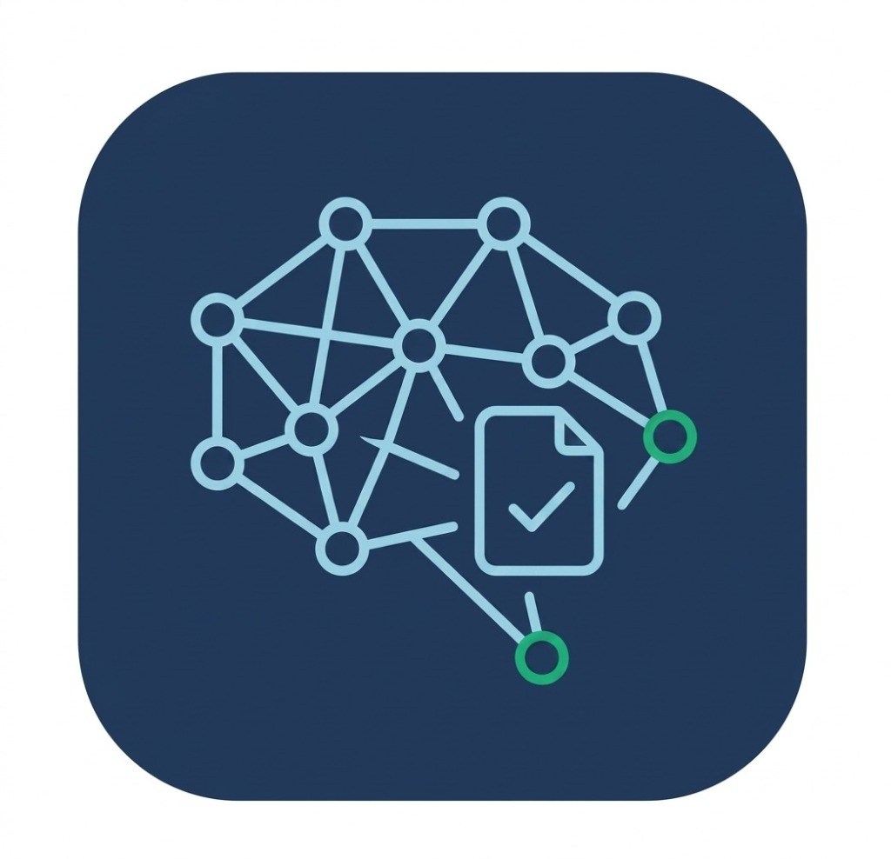

<p align="center">
  
</p>

<h1 align="center">NEXUS</h1>
<p align="center">
  <strong>AI-Powered Knowledge Retrieval for Modern Organizations</strong>
</p>
<p align="center">
  A secure, multi-tenant enterprise document management system with Retrieval-Augmented Generation (RAG)
</p>

<p align="center">
  
  
  
  
  
  
  
</p>

---

## 📌 Overview

**Nexus** is an enterprise-grade platform that transforms organizational documents into an intelligent, AI-powered knowledge system. It features role-based access control, multi-tenant organization isolation, secure file management, unified AI chat, comprehensive audit logging, and a full admin dashboard.

### Architecture

```
┌──────────────────────────────────────────────────────────────────────────┐
│                           NEXUS PLATFORM                                 │
├──────────────┬──────────────────────┬────────────────────────────────────┤
│   CLIENT     │       SERVER         │     ML SERVICE (Phase 2)           │
│   (React)    │    (Express/Node)    │     (Python/FastAPI)               │
│              │                      │                                    │
│  • Landing   │  • Auth (JWT)        │  • RAG Pipeline                    │
│  • Dashboard │  • RBAC Middleware   │  • Document Ingestion              │
│  • Chat UI   │  • File Upload       │  • Semantic Search (ChromaDB)      │
│  • Documents │  • Chat Sessions     │  • Ollama LLM Integration          │
│  • Admin     │  • Audit Logging     │  • Whisper Voice-to-Text           │
│  • Settings  │  • Org Management    │  • Redis Semantic Cache            │
│              │                      │                                    │
│  Port: 5173  │    Port: 5000        │    Port: 8000                      │
└──────────────┴──────────────────────┴────────────────────────────────────┘
                       │                         │
                       ▼                         ▼
              ┌─────────────────┐       ┌─────────────────┐
              │  MongoDB Atlas  │       │   ChromaDB       │
              │  (nexus_db)     │       │   (Vector Store) │
              └─────────────────┘       └─────────────────┘
```

---

## 🛠️ Tech Stack

| Layer      | Technology                                                                 |
|------------|----------------------------------------------------------------------------|
| Frontend   | React 19, Vite 8, TailwindCSS 3, DaisyUI 5, Redux Toolkit, RTK Query      |
| Backend    | Node.js, Express 5, Mongoose 8, JWT, Multer, bcrypt                        |
| Database   | MongoDB Atlas                                                              |
| ML (Phase 2) | Python, FastAPI, Ollama (Llama3/Mistral), ChromaDB, Whisper, Redis       |
| Auth       | Access + Refresh Token (httpOnly cookie), Background auto-refresh          |

---

## 📁 Project Structure

```
Nexus/
├── client/                          # React Frontend
│   ├── public/                      # Static assets (logo, icons)
│   ├── src/
│   │   ├── app/
│   │   │   └── store.js             # Redux store configuration
│   │   ├── features/
│   │   │   ├── auth/                # Authentication
│   │   │   │   ├── authApi.js       # RTK Query base API + reauth
│   │   │   │   ├── authSlice.js     # Auth Redux state
│   │   │   │   └── components/
│   │   │   │       ├── LoginForm.jsx
│   │   │   │       ├── RegisterForm.jsx
│   │   │   │       └── ProtectedRoute.jsx
│   │   │   ├── chat/                # Unified Chat
│   │   │   │   ├── chatApi.js       # Chat session endpoints
│   │   │   │   ├── chatSlice.js     # Chat Redux state
│   │   │   │   └── components/
│   │   │   │       ├── ChatWindow.jsx
│   │   │   │       ├── ChatSidebar.jsx
│   │   │   │       ├── MessageBubble.jsx
│   │   │   │       └── ChatInput.jsx
│   │   │   ├── documents/           # File Management
│   │   │   │   ├── documentApi.js   # Document endpoints
│   │   │   │   ├── documentSlice.js
│   │   │   │   └── components/
│   │   │   │       ├── FileUploader.jsx
│   │   │   │       ├── DocumentTable.jsx
│   │   │   │       └── DocumentCard.jsx
│   │   │   ├── admin/               # Admin Dashboard
│   │   │   │   ├── adminApi.js      # Admin endpoints
│   │   │   │   └── components/
│   │   │   │       ├── StatsCards.jsx
│   │   │   │       ├── UserTable.jsx
│   │   │   │       ├── AdminDocTable.jsx
│   │   │   │       └── AuditLogViewer.jsx
│   │   │   ├── organization/        # Org Management
│   │   │   │   ├── orgApi.js
│   │   │   │   ├── orgSlice.js
│   │   │   │   └── components/
│   │   │   │       └── OrgDetails.jsx
│   │   │   └── settings/            # User Settings
│   │   │       └── components/
│   │   │           ├── ProfileSettings.jsx
│   │   │           └── PasswordChange.jsx
│   │   ├── components/
│   │   │   ├── layout/              # App Shell
│   │   │   │   ├── AppLayout.jsx
│   │   │   │   ├── Sidebar.jsx
│   │   │   │   └── TopBar.jsx
│   │   │   ├── ui/                  # Shared UI Components
│   │   │   │   ├── RoleBadge.jsx
│   │   │   │   ├── LoadingSpinner.jsx
│   │   │   │   ├── ConfirmModal.jsx
│   │   │   │   └── EmptyState.jsx
│   │   │   └── landing/             # Landing Page Components
│   │   │       ├── Navbar.jsx
│   │   │       ├── Hero.jsx
│   │   │       ├── Features.jsx
│   │   │       ├── ChatPreview.jsx
│   │   │       ├── About.jsx
│   │   │       ├── TechStack.jsx
│   │   │       ├── RAGFlow.jsx
│   │   │       ├── Footer.jsx
│   │   │       └── MouseGlow.jsx
│   │   ├── pages/                   # Route Pages
│   │   │   ├── LandingPage.jsx
│   │   │   ├── LoginPage.jsx
│   │   │   ├── RegisterPage.jsx
│   │   │   ├── DashboardPage.jsx
│   │   │   ├── ChatPage.jsx
│   │   │   ├── DocumentsPage.jsx
│   │   │   ├── AdminPage.jsx
│   │   │   ├── SettingsPage.jsx
│   │   │   └── NotFoundPage.jsx
│   │   ├── hooks/
│   │   │   ├── useAuth.js
│   │   │   └── useTokenRefresh.js
│   │   ├── utils/
│   │   │   ├── constants.js
│   │   │   └── helpers.js
│   │   ├── styles/                  # Legacy CSS (landing page)
│   │   ├── App.jsx                  # Root component with routing
│   │   ├── main.jsx                 # Entry point
│   │   └── index.css                # Tailwind directives
│   ├── tailwind.config.js
│   ├── postcss.config.js
│   ├── vite.config.js
│   ├── index.html
│   └── package.json
│
├── server/                          # Express Backend
│   ├── src/
│   │   ├── config/
│   │   │   ├── db.js                # MongoDB connection
│   │   │   └── env.js               # Env validation
│   │   ├── models/
│   │   │   ├── User.js
│   │   │   ├── Organization.js
│   │   │   ├── Document.js
│   │   │   ├── ChatSession.js
│   │   │   └── AuditLog.js
│   │   ├── routes/
│   │   │   ├── authRoutes.js
│   │   │   ├── userRoutes.js
│   │   │   ├── orgRoutes.js
│   │   │   ├── documentRoutes.js
│   │   │   ├── chatRoutes.js
│   │   │   ├── adminRoutes.js
│   │   │   └── auditRoutes.js
│   │   ├── controllers/
│   │   │   ├── authController.js
│   │   │   ├── userController.js
│   │   │   ├── orgController.js
│   │   │   ├── documentController.js
│   │   │   ├── chatController.js
│   │   │   ├── adminController.js
│   │   │   └── auditController.js
│   │   ├── middleware/
│   │   │   ├── auth.js              # JWT verification
│   │   │   ├── rbac.js              # Role-based access control
│   │   │   ├── audit.js             # Audit logging
│   │   │   ├── upload.js            # Multer file upload
│   │   │   ├── errorHandler.js      # Global error handler
│   │   │   └── rateLimiter.js       # Rate limiting
│   │   ├── utils/
│   │   │   ├── tokenUtils.js        # JWT helpers
│   │   │   ├── inviteCode.js        # Invite code generator
│   │   │   └── apiResponse.js       # Response format helpers
│   │   ├── services/
│   │   │   ├── mlBridge.js          # Python ML service bridge (Phase 2)
│   │   │   └── cacheService.js      # Redis cache stub (Phase 2)
│   │   └── app.js                   # Express app setup
│   ├── uploads/                     # File storage (org-scoped)
│   ├── server.js                    # Entry point
│   ├── package.json
│   ├── nodemon.json
│   ├── .env                         # Environment variables
│   └── .env.example
│
├── .gitignore
└── README.md
```

---

## 🔐 Role-Based Access Control (RBAC)

| Feature                | Admin | Member | Guest |
|------------------------|:-----:|:------:|:-----:|
| View Dashboard         |  ✅   |   ✅   |  ✅   |
| Chat with AI           |  ✅   |   ✅   |  ✅   |
| Upload Documents       |  ✅   |   ✅   |  ❌   |
| Delete Own Documents   |  ✅   |   ✅   |  ❌   |
| Delete Any Document    |  ✅   |   ❌   |  ❌   |
| View Admin Dashboard   |  ✅   |   ❌   |  ❌   |
| Change User Roles      |  ✅   |   ❌   |  ❌   |
| Deactivate Users       |  ✅   |   ❌   |  ❌   |
| View Audit Logs        |  ✅   |   ❌   |  ❌   |
| Query Admin-level docs |  ✅   |   ❌   |  ❌   |
| Query Member-level docs|  ✅   |   ✅   |  ❌   |
| Query Guest-level docs |  ✅   |   ✅   |  ✅   |

**Double-Layer Verification:**
- **Frontend**: `ProtectedRoute` component checks role from Redux store
- **Backend**: `rbac()` middleware validates role from JWT + database query

---

## 🚀 Getting Started

### Prerequisites

- **Node.js** ≥ 18
- **npm** ≥ 9
- **MongoDB Atlas** account (connection string pre-configured)

### 1. Clone the Repository

```bash
git clone https://github.com/your-username/Nexus.git
cd Nexus
```

### 2. Setup Server

```bash
cd server
npm install

# The .env file is pre-configured. For production, update the secrets:
# JWT_ACCESS_SECRET, JWT_REFRESH_SECRET

# Start the dev server
npm run dev
```

Server will start at `http://localhost:5000`

### 3. Setup Client

```bash
cd client
npm install

# Start the dev server
npm run dev
```

Client will start at `http://localhost:5173`

### 4. Access the Application

1. Open `http://localhost:5173` — Landing page
2. Click **Get Started** → Register page
3. **Create a new organization** or **Join existing** with an invite code
4. Start uploading documents and chatting!

---

## 🔌 API Endpoints

### Authentication
| Method | Endpoint           | Description                    | Auth |
|--------|-------------------|--------------------------------|------|
| POST   | `/api/auth/register` | Register + Join/Create org     | ❌   |
| POST   | `/api/auth/login`    | Login, returns tokens          | ❌   |
| POST   | `/api/auth/logout`   | Invalidate refresh token       | ❌   |
| GET    | `/api/auth/refresh`  | Refresh access token           | 🍪   |

### Users
| Method | Endpoint              | Description         | Auth | Roles |
|--------|-----------------------|---------------------|------|-------|
| GET    | `/api/users/profile`  | Get own profile     | ✅   | All   |
| PUT    | `/api/users/profile`  | Update name         | ✅   | All   |
| PUT    | `/api/users/password` | Change password     | ✅   | All   |
| DELETE | `/api/users/account`  | Delete account      | ✅   | All   |

### Organization
| Method | Endpoint   | Description        | Auth | Roles |
|--------|-----------|-------------------|------|-------|
| GET    | `/api/org` | Get org details    | ✅   | All   |

### Documents
| Method | Endpoint                 | Description           | Auth | Roles         |
|--------|--------------------------|-----------------------|------|---------------|
| GET    | `/api/documents`         | List docs (filtered)  | ✅   | All           |
| POST   | `/api/documents/upload`  | Upload file           | ✅   | Admin, Member |
| DELETE | `/api/documents/:id`     | Delete document       | ✅   | Admin, Member |

### Chat
| Method | Endpoint                              | Description       | Auth | Roles |
|--------|---------------------------------------|--------------------|------|-------|
| GET    | `/api/chat/sessions`                  | List sessions      | ✅   | All   |
| GET    | `/api/chat/sessions/:id`              | Get session        | ✅   | All   |
| POST   | `/api/chat/sessions`                  | Create session     | ✅   | All   |
| POST   | `/api/chat/sessions/:id/messages`     | Send message       | ✅   | All   |
| DELETE | `/api/chat/sessions/:id`              | Delete session     | ✅   | All   |

### Admin
| Method | Endpoint                           | Description          | Auth | Roles |
|--------|-----------------------------------|----------------------|------|-------|
| GET    | `/api/admin/stats`                | Dashboard stats       | ✅   | Admin |
| GET    | `/api/admin/users`                | List org users        | ✅   | Admin |
| PATCH  | `/api/admin/users/:id/role`       | Change role           | ✅   | Admin |
| PATCH  | `/api/admin/users/:id/deactivate` | Deactivate user       | ✅   | Admin |
| GET    | `/api/admin/documents`            | List all org docs     | ✅   | Admin |
| DELETE | `/api/admin/documents/:id`        | Delete any doc        | ✅   | Admin |

### Audit
| Method | Endpoint           | Description          | Auth | Roles |
|--------|--------------------|----------------------|------|-------|
| GET    | `/api/audit/logs`  | Get audit logs       | ✅   | Admin |

---

## 📊 Audit Events Tracked

| Event              | Description                              |
|--------------------|------------------------------------------|
| `LOGIN`            | User login attempt                       |
| `LOGOUT`           | User logout                              |
| `FILE_UPLOAD`      | Document uploaded                        |
| `FILE_DELETE`      | Document deleted                         |
| `QUERY_SENT`       | Chat query submitted                     |
| `ROLE_CHANGE`      | Admin changed a user's role              |
| `USER_DEACTIVATED` | Admin deactivated a user                 |
| `ACCOUNT_DELETED`  | User deleted their own account           |
| `PROFILE_UPDATED`  | User updated their profile               |
| `PASSWORD_CHANGED` | User changed their password              |

Each log captures: `timestamp`, `userId`, `ipAddress`, `action`, `result`

---

## 🧩 Phase 2: ML Service (Future Integration)

The ML microservice will be built separately by the ML team using:

- **Python/FastAPI** — REST API server
- **Ollama (Llama3/Mistral)** — Local LLM for response generation
- **ChromaDB** — Vector database for semantic search
- **Whisper** — Voice-to-text transcription
- **Redis** — Semantic query caching

### Integration Points

The `server/src/services/mlBridge.js` file contains pre-built HTTP bridge functions:

| Function          | ML Endpoint      | Description                         |
|-------------------|------------------|-------------------------------------|
| `ingestDocument`  | `POST /api/ingest` | Chunk + embed uploaded documents   |
| `queryRAG`        | `POST /api/query`  | Semantic search + LLM generation   |
| `transcribeAudio` | `POST /api/transcribe` | Whisper audio transcription    |

These functions currently return graceful fallbacks when the ML service is unavailable.

---

## 👥 Team Contribution Guide

### For Frontend Developers
1. Work in `client/src/`
2. Follow the feature-based folder structure
3. Use DaisyUI components + Tailwind utilities
4. Use RTK Query for all API calls
5. Test components at `http://localhost:5173`

### For Backend Developers
1. Work in `server/src/`
2. Follow the MVC pattern (routes → controllers → models)
3. Always add `auth` middleware on protected routes
4. Always add `rbac()` middleware for role-restricted routes
5. Log critical actions using `logAuditEvent()`
6. Test API with `http://localhost:5000/api/health`

### For ML Engineers
1. Build the ML service as an independent FastAPI server
2. Implement the three endpoints: `/api/ingest`, `/api/query`, `/api/transcribe`
3. Set `ML_SERVICE_URL` in the server's `.env`
4. The Node.js server's `mlBridge.js` will automatically connect

---

## 📜 Environment Variables

### Server (`server/.env`)
```env
PORT=5000
NODE_ENV=development
MONGO_URI=mongodb+srv://...
JWT_ACCESS_SECRET=your_secret
JWT_REFRESH_SECRET=your_secret
JWT_ACCESS_EXPIRES=15m
JWT_REFRESH_EXPIRES=7d
ML_SERVICE_URL=http://localhost:8000
```

### Client (`client/.env`)
```env
VITE_API_URL=http://localhost:5000/api
```

---

## 📄 License

This project is proprietary and confidential.